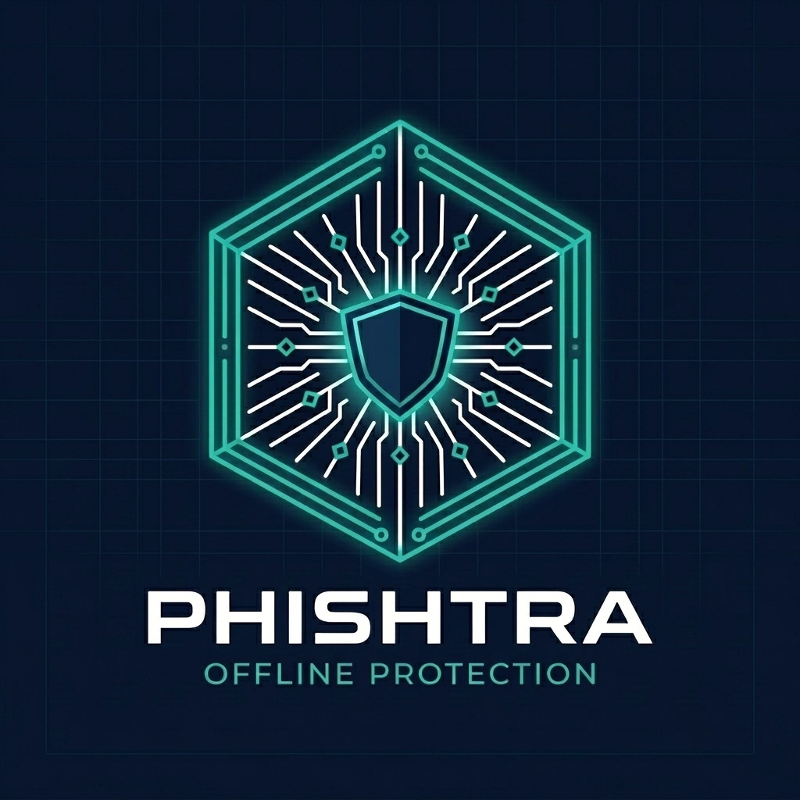

<div align="center">

<!-- ═══════════════════════ HEADER BANNER ═══════════════════════ -->


<br />



<br /><br />

<!-- ANIMATED TYPING TAGLINE -->


<br /><br />

<!-- BADGE ROW -->

&nbsp;

&nbsp;

&nbsp;


<br /><br />

</div>

---

<br />

<!-- ╔══════════════════════════════════════════════════════════════╗ -->
<!-- ║               COMMERCIAL USE NOTICE                         ║ -->
<!-- ╚══════════════════════════════════════════════════════════════╝ -->

<div align="center">
<table>
<tr>
<td align="center">
<br />

# 🚫 &nbsp; COMMERCIAL USE NOTICE &nbsp; 🚫

<br />

# **⛔ THE CORE PHISHTRA ENGINE, SOURCE CODE, AND ALL DETECTION ALGORITHMS ARE STRICTLY PRIVATE & PROPRIETARY ⛔**

<br />

## **This repository contains ONLY the public-facing demo and promotional showcase.**
## **No part of the core technology may be used, copied, modified, distributed, or reverse-engineered without explicit written authorization.**
## **This project is NOT open-source. All Rights Reserved.**

<br />


&nbsp;&nbsp;


<br />

</td>
</tr>
</table>
</div>

<br />

---

<br />

## 🌟 &nbsp; What is Phishtra?

**Phishtra** is a state-of-the-art cybersecurity suite engineered to eliminate modern phishing, typosquatting, and brand impersonation threats — in real time, on your device.

Powered by a high-performance **WebAssembly (WASM) engine** embedded directly in the browser, Phishtra intercepts dangerous navigations **before they ever render** — with zero data leaving your device.

> **Unlike cloud-based solutions that transmit your browsing history for remote analysis — Phishtra performs 100% of threat detection locally. What happens on your device, stays on your device.**

<br />

---

## 🚀 &nbsp; Core Capabilities

<br />

<div align="center">
<table>
<tr>
<td width="50%" valign="top">

### 🔒 &nbsp; 100% Offline Analysis

No telemetry. No tracking. No API calls. Phishtra's advanced heuristics and embedded rulesets run entirely within your browser or Android sandbox.

**Your browsing data never touches an external server.**

</td>
<td width="50%" valign="top">

### 🛑 &nbsp; Proactive Shield Interception

Traditional scanners warn you *after* tracking pixels and scripts have already executed. Phishtra acts as a hard barricade — blocking the navigation and serving a local warning **before the page ever loads.**

</td>
</tr>
<tr><td colspan="2"><br /></td></tr>
<tr>
<td width="50%" valign="top">

### 📱 &nbsp; Cross-Platform Ecosystem

- **Browser Extension** — Chrome · Edge · Safari
- **Android App** — System-wide VPN routing that protects **all apps**, not just the browser

</td>
<td width="50%" valign="top">

### 📊 &nbsp; Deep Diagnostic Insights

Phishtra doesn't just block — it explains. Transparent threat reports expose **homograph attacks**, suspicious TLDs, zero-width character injections, and more.

</td>
</tr>
</table>
</div>

<br />

---

## 🛡️ &nbsp; Privacy Architecture

<br />

<div align="center">

```
┌──────────────────┐   ┌──────────────────┐   ┌──────────────────┐
│   🚫 ZERO LOGS   │   │  📡 ZERO TRANS.  │   │ 💰 ZERO MONETIZ  │
│                  │   │                  │   │                  │
│  We do not log   │   │  Your URLs never │   │  We do not sell, │
│  the sites you   │   │  hit any cloud   │   │  share, or mine  │
│     visit.       │   │     server.      │   │  browsing data.  │
└──────────────────┘   └──────────────────┘   └──────────────────┘
```

> ***Privacy is a fundamental product requirement — not an optional feature.***

</div>

<br />

---

## 💻 &nbsp; Live Demo Showcase

<div align="center">

<br />

[](https://Uditpandya07.github.io/PHISHTRA-DEMO/)

<br />

<sub>A high-fidelity showcase of Phishtra's UI, UX, and design philosophy.<br />The underlying WASM engine and proprietary detection algorithms are excluded from this public build.</sub>

<br />

</div>

---

<br />

<!-- ═══════════════════════ FOOTER BANNER ═══════════════════════ -->

<div align="center">


<sub>⚡ Engineered for speed &nbsp;·&nbsp; Designed for privacy &nbsp;·&nbsp; Built for trust.</sub>

<br />

**© 2026 Phishtra — All Rights Reserved.**

</div>